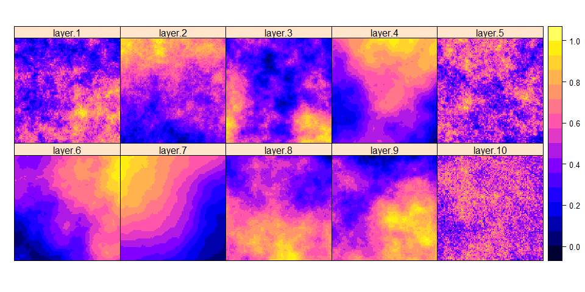

Simulate environmentally determined species presence and
presence-absence data in R
================
<font size="5">Marc A. Beer</font> <br>
<font size="4">9/21/2022</font> <br>

# 1. Simulating environmental factors

<br> <font size="5"> Ecological niche models (ENM) use as input at least
one (often more!) environmental factors to identify associations between
local environmental conditions and local habitat suitability or
probability of species presence. </font> <br><br>

<font size="5"> To evaluate the efficacy of a particular ENM method in
recovering real or true patterns of habitat suitability (or probability
of species presence), it is necessary to use simulation. We will first
simulate numerous environmental factors, which will ultimately be used
to simulate our response variable. We will use the package *NLMR* to
simulate realistic environmental surfaces with varying magnitudes of
spatial autocorrelation. *NLMR* can be found on GitHub at the repository
“ropensci/NLMR” and the associated peer-reviewed publication can be
accessed
[here](https://besjournals.onlinelibrary.wiley.com/doi/full/10.1111/2041-210X.13076).
</font> <br><br>

``` r
#load libraries
library(raster)
library(NLMR)
library(ggplot2)

###
#simulate fractional brownian motion (fbm) surfaces with varying spatial autocorrelation

#set number of surfaces to be simulated
n <- 100

#set new seed for each surface to be simulated
seeds <- seq(1:n)

#draw random values for the fract_dim parameter of nlm_fbm(), which controls spatial autocorrelation
set.seed(1)
fd_val <- runif(n=length(seeds), min=0, max=2)

#simulate n rasters and stack them
rasters <- list()
for(i in 1:length(seeds)){
  r <- NLMR::nlm_fbm(ncol=100, nrow=100, fract_dim=fd_val[i], user_seed=seeds[i], rescale=TRUE)
  rasters <- append(rasters, r)
}
rasterstack<-stack(rasters)
```

<br><br>

<font size="5"> Let’s plot a handful of our environmental factors to
confirm that they appear fairly realistic and vary in spatial
autocorrelation. </font>

``` r
#plot first 10 rasters representing different environmental factors
spplot(rasterstack[[1:10]])
```


<br>

# 2. Simulating species presence probabilities

<br>

<font size="5"> Probabilities represent binomial data, so we will
simulate probability of species presence using a process that amounts to
the simulation of binomial regression data, with our environmental
factors input as explanatory factors. </font> <br><br>

<font size="5"> Briefly, for each of our n environmental factors, we
will simulate a Beta coefficient representing its relationship with
probability of species presence. For this tutorial, these Beta
coefficients will be drawn from a normal distribution with mean zero and
standard deviation \< 1. The mean of zero means that the Beta
coefficients for most environmental factors will be small, such that
most factors have small effects on species presence. Other distributions
could be swapped in if desired. Higher values for the standard deviation
mean that many variables will have large effects; this tends to drive
the resulting raster of species presence probabilities into a binary
state, which may be desirable in some cases. We use a small standard
deviation to promote the simulation of intermediate species presence
probabilities (e.g., 0.10 - 0.90) with fewer extreme values. **For now,
we will only consider monotonic increasing or decreasing relationships
between species presence probability and each environmental factor.**
</font>

``` r
###
#simulate binomial data to generate probabilities of species presence based on simulated rasters

#store raster data as a data frame
stack_df <- as.data.frame(rasterstack, xy=TRUE)

#center-scale each layer
stack_df <- cbind(stack_df[,1:2], scale(stack_df[,-c(1:2)], center=TRUE, scale=TRUE))

#draw beta coefficients for use in binomial regression simulation
set.seed(1)
beta <- rnorm(n=length(seeds), mean=0, sd=0.25)
#beta <- runif(n=length(seeds), min=-0.5, max=0.5)
```

<br>

<font size="5"> Let’s visualize the distribution of Beta coefficients
that we simulated </font>

``` r
ggplot(data.frame(x=beta), aes(x = beta)) + 
  geom_histogram(aes(y = ..density..),
                 colour = 1, fill = "slateblue1", bins=n/8, alpha=0.5) +
  geom_density()+
  labs(x="Beta coefficient", y="Density")+
  theme(panel.grid.major = element_blank(), panel.grid.minor = element_blank(),
panel.background = element_blank(), axis.line = element_line(colour = "black"))
```


<br><br>

<font size="5"> Having simulated a Beta coefficient for each of our
environmental factors, let’s now simulate species presence
probabilities. </font>

``` r
#create matrix of beta coefficients
##allows multiplication of columns between stack_df and beta_matrix
beta_matrix <- matrix(rep(beta, each=nrow(stack_df)), nrow=nrow(stack_df), ncol=length(seeds), byrow=FALSE)

#for each environmental factor, multiply the local value by that factor's beta coefficient
x_beta <- stack_df[,-c(1:2)] * beta_matrix
x_beta_sum <- rowSums(x_beta)

#calculate y (probability of species presence)
y <- exp(x_beta_sum) / (1 + exp(x_beta_sum))
```

<br>

<font size="5"> Let’s insert our species presence probabilities back
into a raster for visualization. </font>

``` r
#insert y values into raster
prob_rast <- raster::setValues(x=rasters[[1]], values=y)

#plot resulting raster
spplot(prob_rast)
```


<br>

# 3. Simulating presence-only or presence-absence data

<br>

<font size="5"> Now that we have a surface representing true species
presence probabilities, for each cell we can draw a success (species
observed) or failure (species not observed) based on the local species
presence probability. These represent the equivalent of empirical
observations. We can visualize one such set of observations. Note that
repeating this many times and averaging the results will recover the
underlying probability raster. </font> <br>

``` r
#create landscape-wide binary presence/absence data based on the probability raster
set.seed(1)
y_binary <- c()
for (i in 1:length(y)){
  y_binary[i] <- rbinom(n=1, size=1, prob=y[i])
}

#insert values into raster
binary_rast <- raster::setValues(x=rasters[[1]], values=y_binary)

#plot raster
spplot(binary_rast)
```


<br>

<font size="5"> To create a presence-only dataset we can randomly select
a desired number of cells *from all the cells containing values of 1*.
</font> <br>

<font size="5"> To create a presence-absence dataset, we can randomly
select a desired number of cells *from the entire raster*, which will
consequently contain both values of 1 and 0. </font> <br>
